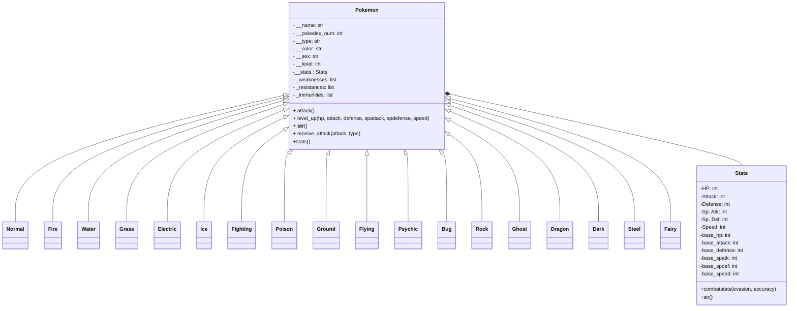

# Poke-repo
Repositorio para aprender POO usando la teoria de pokemon

## Definición 

Creaturas ficticias que viven en un mundo alternativo junto a humanos. La palabra Pokemon es el acronimo de *Pokcet Monsters*. 

### Características
- Nombre
- No en el pokedex
- Tipo principal
- Tipo Secundario
- Sexo
- Peso
- Altura
- Color
- Habilidad
- Habilidad Oculta
- Naturaleza
- Estadisticas
- Ataques
- Evoluciones

### Comportamientos
- Atacar
- Evolucionar

## Diagram



## Running 

### Linux

Create a `venv` 
```sh
python -m venv v_pokemon 
source v_pokemon/bin/activate
pip install -r requirements.txt
```

### Windows


## Testing

En el directorio raíz ejecutar

```sh
python -m test.test_types
```


