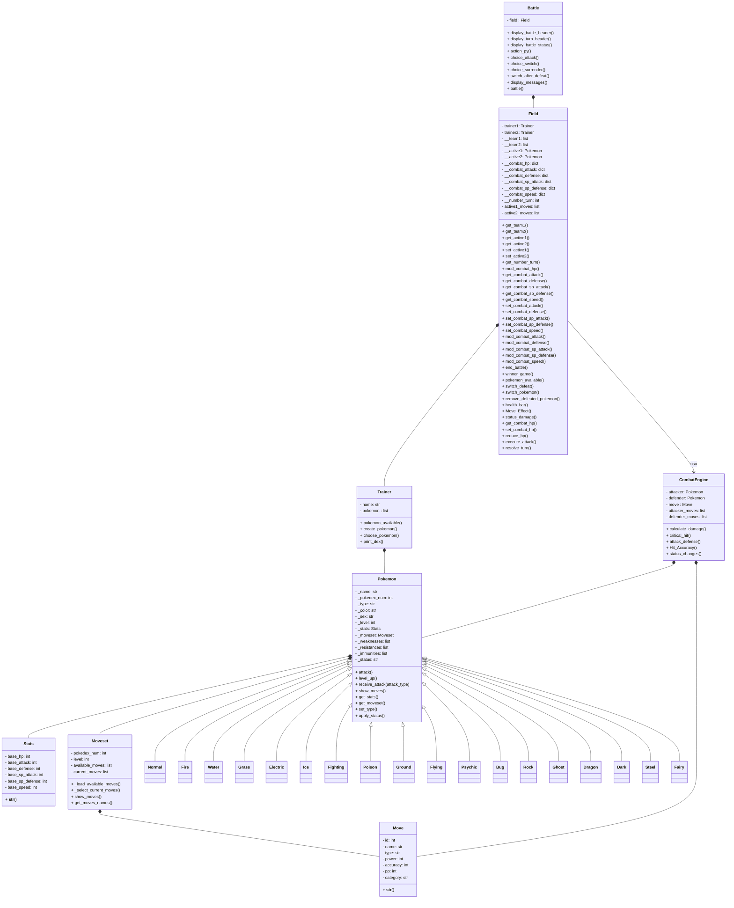

# Poke-repo
Repositorio para aprender POO usando la teoria de pokemon

## Definición 

Creaturas ficticias que viven en un mundo alternativo junto a humanos. La palabra Pokemon es el acronimo de *Pokcet Monsters*. 

### Características
- Nombre
- No en el pokedex
- Tipo principal
- Tipo Secundario
- Sexo
- Peso
- Altura
- Color
- Habilidad
- Habilidad Oculta
- Naturaleza
- Estadisticas
- Ataques
- Evoluciones

### Comportamientos
- Atacar
- Evolucionar

## Diagram


## Running 

Crear un entorno virtual e instalar las dependencias.

### Linux

Crear un `venv` 
```sh
python -m venv v_pokemon 
source v_pokemon/bin/activate
pip install -r requirements.txt
```

### Windows

Crear un `venv` 
```sh
## Use cmd/powershell
python -m venv v_pokemon
v_pokemon\Scripts\activate
pip install -r requirements.txt
```

**Note:** Si se obtiene un error de permisos en powershell, ejecutar como administrador y correr el siguiente comando:

```powershell
Set-ExecutionPolicy -ExecutionPolicy RemoteSigned -Scope CurrentUser
```


## Testing

Requiere `pytest`

En el directorio raíz ejecutar

```sh
pytest tests/test_types.py -v
```


